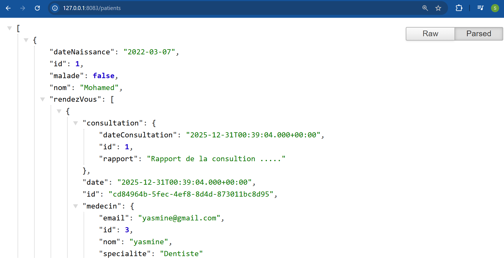

# **Compte Rendu – Activité Pratique ORM, JPA et Spring Data**

## **Introduction**

Pour cette activité pratique dans le cadre du cours **Architecture JEE** à **Mundiapolis**, j’ai voulu me familiariser avec **Spring Boot**, **JPA**, **Hibernate** et **Spring Data JPA**.  
L’objectif était de créer une application de gestion hospitalière capable de gérer les **patients**, les **médecins**, les **rendez-vous** et les **consultations**.  

Ce projet m’a permis de comprendre comment **l’injection de dépendances** fonctionne dans Spring et comment organiser un projet en couches propres : **entités**, **repositories**, **services** et **contrôleurs REST**.

---

## **Mise en place du projet**

J’ai commencé par :  

* Installer **IntelliJ Ultimate**.  
* Créer un projet Spring Boot via Spring Initializer avec les dépendances :
  - **Spring Web**
  - **Spring Data JPA**
  - **H2 Database**
  - **Lombok**
* Créer les entités JPA suivantes :
  - **Patient** : id, nom, date de naissance, malade, liste des rendez-vous
  - **Medecin** : id, nom, email, spécialité, liste des rendez-vous
  - **RendezVous** : id, date, status, patient, médecin, consultation
  - **Consultation** : id, date de consultation, rapport, rendez-vous associé
* Créer les repositories Spring Data JPA pour chaque entité.  
* Créer le service **IHospitalService** et son implémentation **HospitalServiceImpl** pour gérer la logique métier via **injection de dépendances**.

---

## **Fonctionnement**

Au démarrage de l’application, le **CommandLineRunner** insère automatiquement :

* Trois patients : Mohamed, Hassan et Najat  
* Trois médecins : Aymane, Hanane et Yasmine  
* Un rendez-vous entre le premier patient et Yasmine  
* Une consultation associée à ce rendez-vous avec un rapport  

Toutes les opérations CRUD peuvent être effectuées via le service ou les repositories directement. L’injection de dépendances permet de séparer la couche métier de la couche accès aux données. Un contrôleur REST expose la liste des patients via l’URL `/patients`.

---

## **Résultats**

L’application fonctionne correctement, les entités sont persistées dans la base H2 au démarrage et peuvent être consultées via l’API REST.  
Les relations entre les **patients**, **médecins**, **rendez-vous** et **consultations** sont correctement gérées grâce aux annotations JPA et à l’injection de dépendances.  

---

## **Capture d’écran**

